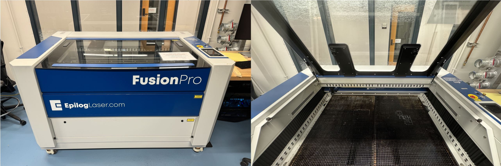

# Epilog FusionPro Laser Cutter

This article goes over the Epilog FusionPro Laser in the DigiFab lab. The laser has a dedicated workstation computer next to it that will be used to run cutting operations. If you have been granted access to the workstation, you will be able to see the login information at: [stache.utexas.edu](https://stache.utexas.edu/)

Prior to using the Epilog Laser, please familiarize yourself with the locations of the:

+ Fire extinguisher
+ Exhaust fan control
+ Emergency stop (on the laser itself)
+ Safety glasses

and read all safety material that may be present at the Laser work area.

The `Exhaust Fan Control` is next to the south door and can be set between 1 and 10. While operating the laser, make sure to set the fan to 10. When finished, turn it down to 5. The exhaust fan should never be set below 5 to ensure that air continuously blows.
Please remember to turn this back down before leaving, once you're finished with the laser cutter.

## I. Gettings Started

To get started, first log into the workstation next to the laser. If already have your laser cut file (.svg), feel free to proceed to III. Running a Print. Otherwise, proceed to section II to go over how to design your .SVG file for laser cutting.

## II. SVG Design for Laser Cutting Basics

The Epilog FusionPro laser uses .SVG files to interpret what to cut and engrave. There are a handful of softwares you can use to create these .SVG files, such as CorelDraw and Inkscape. Both softwares are available on the laser workstation. Note that CorelDraw is a subscription based software while Inkscape is free, so if you wish to download one on your personal computer, Inkscape may be preferable. Download Inkscape here: https://inkscape.org/release/inkscape-1.3/

### Designing an Operation from Scratch

### Importing from an Existing File

## III. Running a Print
The printing procedures are, briefly: 

+ Submitting a job
+ Aligning the material
+ Pushing the job to the laser
+ Jogging & Focusing the laser
+ Running the job

### Startup Procedures

+ Turn on exhaust air supply to 10
+ Turn the key to ON
+ Verify E-STOP is released

### Shut Down Procedures

+ Engage E-STOP
+ Turn the key to OFF
+ Turn down exhaust supply (to 5)

# Warnings
** LEAVE THE DOOR CLOSED for 10 seconds after a job finishes to clear the smoke **

*Exhaust Fan Control* MUST be turned on prior to running jobs. It clears toxic fumes that result from the laser cutting process.

## Machine Interface
A brief description of the components of the Laser's Ui is explained below:

###    Submitting jobs
To load a job, you must 'print' to the laser cutting driver, like you would an actual printer. Typically this is as simple as File > Print. In the Print window, select "Epilog Engraver" as the desired printer and press Print.

Generally, you should be printing from a vector graphics program like Inkscape, CorelDraw, or Illustrator.

Once on the Dashboard you can select 'Engrave' or 'Vector cut' and select a profile for the material and thickness that you're working with. 

### Aligning materials 
Materal alignment is done through a combination of moving the material and adjusting the placement of the design in the Epliog Dashboard

After printing, it should open in the Epilog Dashboard where you can see your document and the inside of the printer. You can move your design onto the material you placed inside the bed.

### Pushing the job 
Now you can 'Print' the job from the Dashboard, submitting it to the cutter. After this is done, it will be selectable on the File Explorer section of the touchscreen. 

###    Jogging the head
On the touchscreen of the cutter, select the 'Joystick' tab, which will allow you to control the head with the actual joystick. Move the head over to your material. Now you can autofocus the machine.

###    Focus for the material
On the same screen, select the 'Auto Focus' button. The bed will move up towards the head until it engages the sensor.

### Running the Job
Now you're ready to run the job. Go to the File Explorer section and select your the job that you pushed earlier. If you're ready to continue, press the physical 'Play/Pause' button. This will start the job. 

## IV. Materials
Any material that contains chlorine (e.g. PVC, vinyl) will *DESTROY* the laser. Please *ONLY* use the materials listed below, which are listed as acceptable from the manufacturer.

If requested, you may need to prove that the material you’re using is on the allow-list. Please bring a copy of your purchase order or MSDS for the materials you bring in.

In text form, the materials list from the above image are reproduced below.

## Acceptable, Cut and Engrave
  + Wood
  + Acrylic
  + Fabric
  + Delrin
  + Leather
  + Matte Board
  + Melamine
  + Mother of Pearl
  + Paper
  + Mylar
  + Pressboard
  + Rubber
  + Wood Veneer
  + Fiberglass
  + Cork
  + Corian

## Acceptable, Engrave

  + Anodized Aluminum
  + Glass

*If you do not see the material you wish to cut/engrave in the list above, please contact a DigiFab staff member to see if your material is safe to be used on the laser.*

## V. Optional Table Beds and Other Information
There are different types of tables available for different types of jobs. 

### Vector
If you're going to be vector cutting, or engraving then cutting out the outline, you ** MUST ** use the grid shaped bed. Using the other bed types will lead to scarring of the bed, and worse yet, release of unwanted chemicals. 

### Engrave
If you _only_ want to engrave, you can use the engraving bed, which is mostly a solid and very flat. If you want to Vector cut the outline of the engraving, you will need to move it over to the grid type bed first, or start the engraving on the grid bed and cut it afterwards.
  + Stainless Steel*
  + Brass*
  + Titanium*
(*)Note: bare metals are only markable if coated with a metal marking solution.

