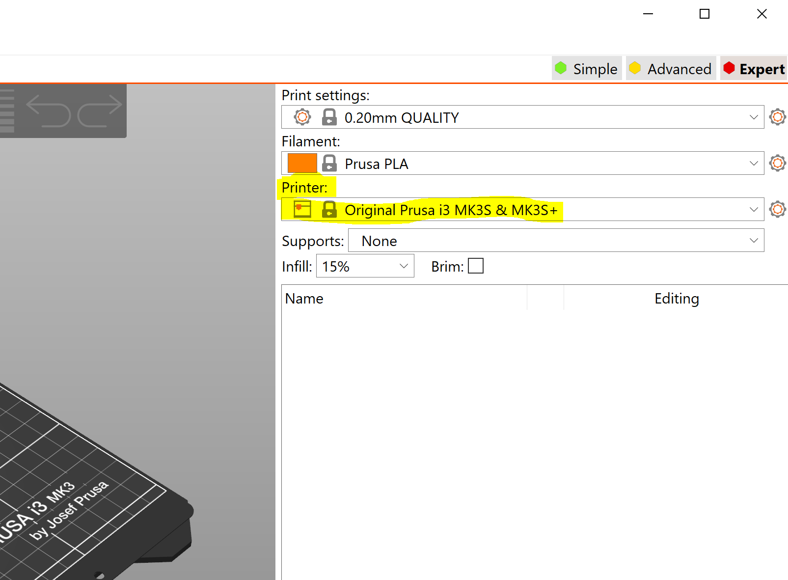
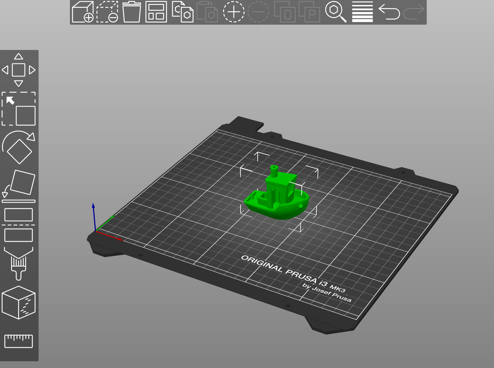
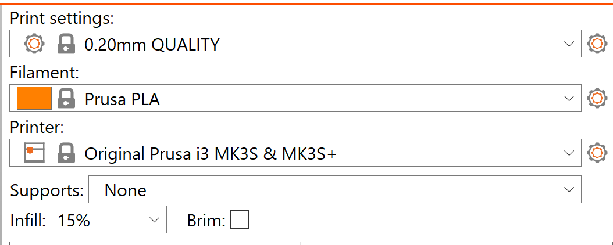
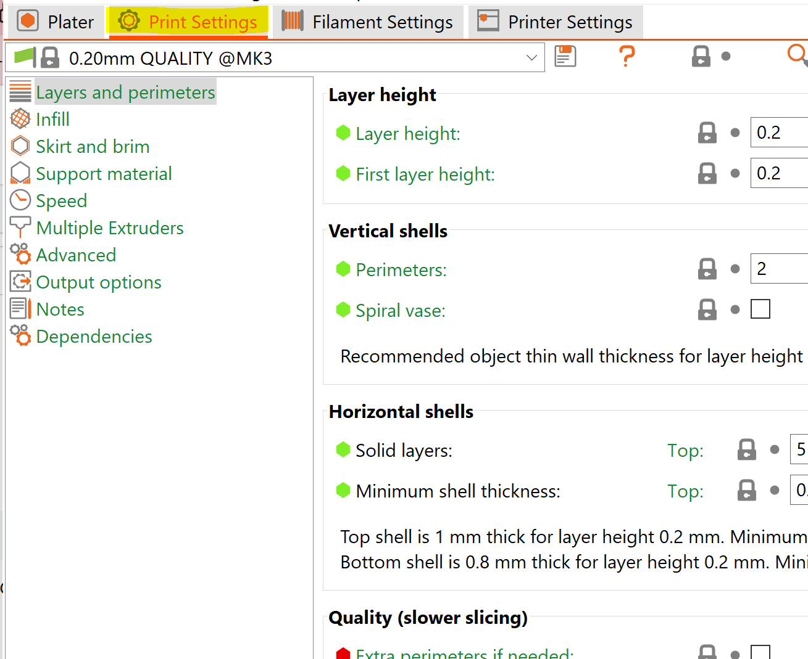
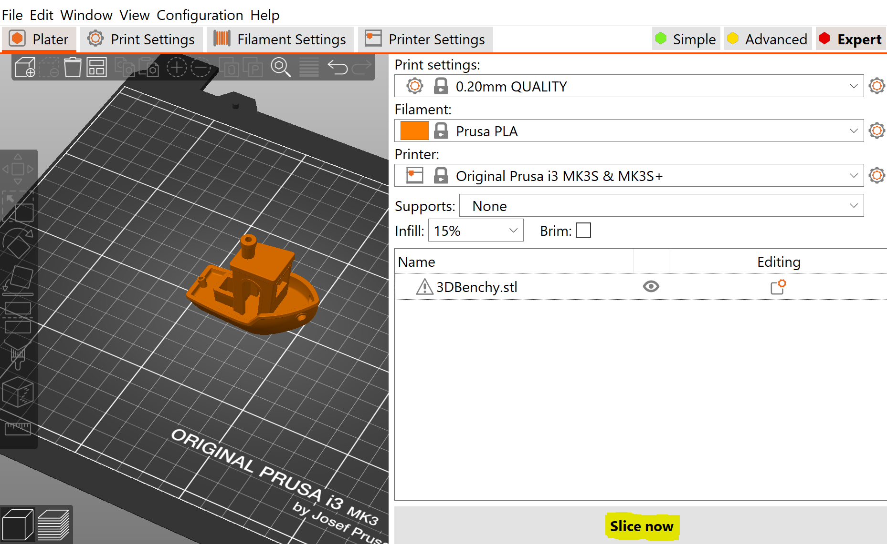

# Prusa Mk3S+ Startup Guide

This article goes over the Prusa Mk3S+ machines in the DigiFab lab (AHG 1.106). 

## Getting Started

### I. PrusaSlicer installation

We have two desktop computers in the DigiFab lab that are available for user usage. These desktops have the required software installed on them,
but many users prefer to install the software on their own computers for ease of access. If you do not wish to go through the installation process,
proceed to Step II.

+ Install PrusaSlicer to your local machine (Supports Windows/Mac/Linux): https://www.prusa3d.com/page/prusaslicer_424/
+ Open PrusaSlicer
+ In the top right of the screen, under select the option "Original Prusa i3 MK3S & MK3S+" to configure your slicer for the printers in the lab.

### II. PrusaSlicer Walkthrough

To import your model to PrusaSlicer, either drag-and-drop your file into PrusaSlicer, or select Add [Ctl+I] to select your file. File must be a .stl filetype.

If successfully imported, you will see your model on the digital printbed. From here, you may wish to use the layout options on the right side of the screen to
move/rotate your model. You may also import more than one model at a time to print.

Once your model(s) have been located and oriented, adjust your print settings and verify that they are appropriate for your current print. Verify that the 
filament settings matches the type of filament that you intend to print with. If you want, adjust the layer height (Print Settings) and infill. Standard layer height
is between 0.15-0.2mm with 15% infill. 

If you want more in-depth settings, you can access the full print settings by selecting "Print Settings" at the top.

When you are ready to print, select "Slice Now" in the bottom right of the screen. This will slice your model and prepare the g-code for printing.
You can scrub through print layers using the orange slider to the side and bottom of the view screen. If everything looks correct, select "Export g-code"
to save the g-code for the print. This is the file that you will transfer to the printer itself.

### III. Starting a Print

Once you have generated the gcode for your print, you can now upload it to one of the four printers in the DigiFab lab. To do this, you will need to upload the file to the SD card on the printer. If you do not have an SD card reader on your computer, there should be a USB adapter next to the printers that you are welcome to use to transfer your file.

With the gcode file saved, insert the SD card into the left side of the printer. The printer should begin sorting files, and will then open a list of files on the card. The list is organized by most recent, so your file should be at the top of the list. If the printer is already loaded with filament, you can select your print file with the knob and the printer will begin printing. If you have not yet loaded your filament into the printer, proceed to Section IV before printing.

### IV. Loading / Unloading The Printer

Loading filament on the Prusa printers is relatively simple. Any time you plan to print, verify that the filament that you intend to use is the same type that you selected in the slicer (whether it's PLA, PETG, etc) as different filaments will have different temperature requirements. To load your filament, select "Autoload Filament" and select the type of filament you plan to use. Once the extruder heats up to the appropriate temperature, it will beep and display a prompt requesting the user to insert filament, at which point you may do so. Once the filament comes into contact with the drive gears, it will begin extruding the filament, at which point the user should not add any additional pressure to the filament. 

After 10-15 seconds, the printer will beep and display a prompt asking if the extruder is extruding the correct color. If you want to run more filament through the extruder to ensure that no old material remains, select "No" and it will extrude for a further 5-10 seconds (recommended to do this 1-2 times, especially if changing color or type of filament). Once satisfied, you may select "Yes' and the printer loading operation will be complete.

To unload, select "Unload" from the display menu. If prompted, select the currently loaded material and the printer will begin heating up. Once at the appropriate temperature, the user will be prompted to press the knob to unload. Upon doing this, the printer will unload the filament and beep when complete, at which point the filament can be removed from the extruder head. Make sure to cut the melted end of the filament to ease loading next time the spool is used and prevent jamming.

(Note: Some photos of the Prusa's should be added where relevant to add clarity)
